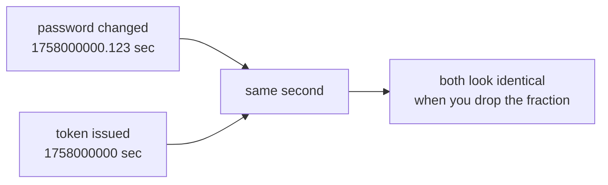
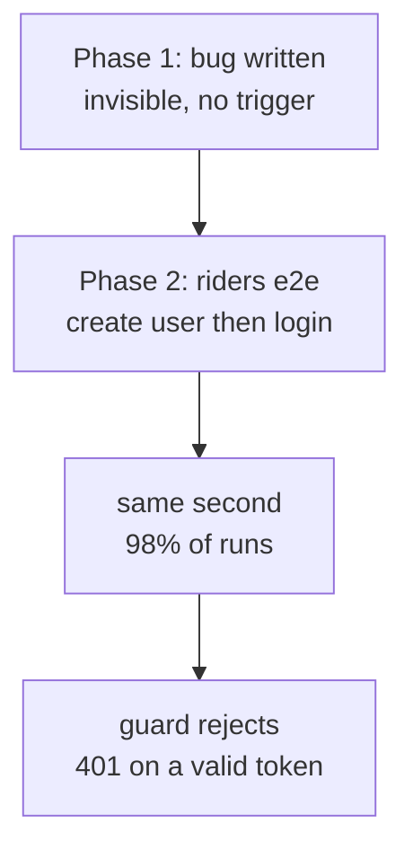
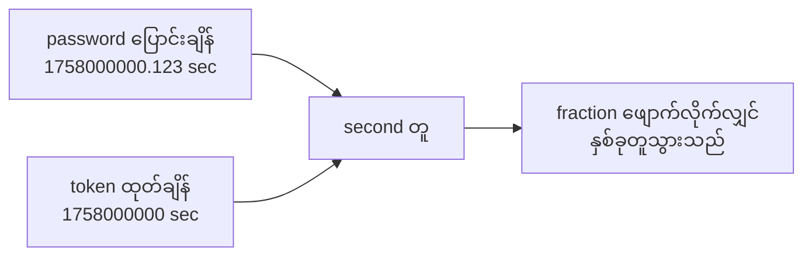
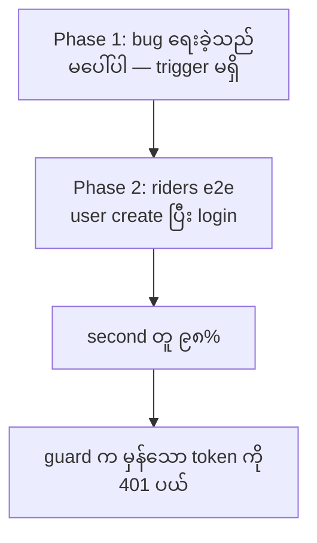

# Why the auth module changed while building riders

## The short version

When a user changes their password, every token issued **before** that change must stop working. The code that enforces this was comparing two clocks that do not have the same precision. The comparison was wrong from the day it was written, but nothing noticed — because no feature ever created a user and immediately logged in as that user. Riders was the first one to do that. So the bug was exposed by Phase 2, not caused by it.

---

## 1. The feature

A token is a signed string. Once issued, the server normally trusts it until it expires — it cannot "take back" a token that is already out in the world.

The one exception: when a user changes their password, any token minted before that moment is considered compromised (someone may have stolen it). So the guard checks, on **every single request**:

> Was this token issued before the user's password was last changed? If yes → reject with 401.

Code: `src/common/auth/auth.guard.ts`

---

## 2. Two clocks, two precisions

Two timestamps are compared:

| What | Where it lives | Precision | Example value |
|---|---|---|---|
| Password changed at | `users.password_changed_at` (Postgres `timestamptz`) | **milliseconds** | `1758000000123` |
| Token issued at | JWT `iat` claim (set by `jsonwebtoken`) | **whole seconds** (RFC 7519) | `1758000000` |

These are **not the same number even for the same instant.** Convert the millisecond value to seconds:

```
1758000000123 / 1000 = 1758000000.123
```

It keeps a decimal fraction. It is not equal to `1758000000`.



---

## 3. The bug

The committed code was:

```ts
row.passwordChangedAt &&
payload.iat !== undefined &&
row.passwordChangedAt.getTime() / 1000 > payload.iat
```

`getTime()` returns **milliseconds**. Dividing by 1000 leaves a fraction behind. So the real comparison was:

```
1758000000.123 > 1758000000
```

That is **true** — the fraction makes it greater. The guard then threw 401.

So the actual rule being enforced was not:

> "Reject tokens older than the password change."

It was:

> "Reject any token if the password was changed at *any point during the same second* the token was issued."

A token minted **after** the password change — but in the same second — was rejected. That is wrong. The user would change their password, log in again immediately, and get a 401.

---

## 4. Why nobody noticed until Phase 2

The bug needs a specific sequence:

1. Write a `users` row (which sets `password_changed_at = now`)
2. Mint a token for that same user within the same second

No earlier flow did both. Look at the timing:

| Flow | Creates user | Logs in as that user | Same second? |
|---|---|---|---|
| OWNER/ADMIN seed | yes, at setup | much later (manual / e2e `beforeAll`) | no |
| Phase 1 user CRUD | yes | **no — never logs in as them** | — |
| `test/auth.e2e-spec.ts:464` | yes (`insertUser`) | yes (`login`) | **yes** |
| Phase 2 `POST /riders` → `login` | yes | yes | **yes** |

The riders e2e (`test/riders.e2e-spec.ts:107-116`) creates a rider, then logs in as that rider to prove the account works. Two HTTP calls, about 20 ms apart. 20 ms is well inside one second, so the two timestamps land in the same second **almost every time**.

So the sequence is:



The bug was latent for an entire phase. Phase 2 did not introduce it — it revealed it.

---

## 5. First fix attempt, and why it failed

The obvious patch is to remove the fraction:

```ts
Math.floor(row.passwordChangedAt.getTime() / 1000) > payload.iat
```

Now: `1758000000 > 1758000000` → **false**. Riders passes. Good.

But then `test/auth.e2e-spec.ts:465` failed:

```
invalidates old tokens after a password change (401)
  expected 401 "Unauthorized", got 200 "OK"
```

That test covers the opposite case: a token issued **before** the change, in the same second. It must be rejected. Riders needs same-second → **accept**. Auth needs same-second → **reject**.

Both cases now floor to the same number, so both get the same answer. One of them must be wrong.

**This failure is the important part.** It proves the problem cannot be solved by adjusting the comparison. Try `>`, `>=`, floor, or ceil — every variant gives the same answer to both cases, because both cases *are* the same number at second resolution. The information needed to tell them apart was thrown away before the comparison even ran.

That is why the fix had to change **what is stored**, not **how it is compared**.

---

## 6. The fix: record the exact instant

Stop deriving one clock from the other. Carry the precision you actually need.

**Step 1** — At login, stamp the exact instant in milliseconds (`src/auth/auth.service.ts`):

```ts
const payload: JwtPayload = {
  sub: user.id,
  email: user.email,
  roleId: user.roleId,
  tokenIssuedAtMs: Date.now(),   // exact, millisecond precision
};
```

**Step 2** — The guard compares milliseconds to milliseconds (`auth.guard.ts`):

```ts
private isTokenStale(payload: JwtPayload, passwordChangedAt: Date): boolean {
  const changedAtMilliseconds = passwordChangedAt.getTime();

  if (payload.tokenIssuedAtMs !== undefined) {
    return changedAtMilliseconds > payload.tokenIssuedAtMs;
  }

  if (payload.iat !== undefined) {
    return Math.floor(changedAtMilliseconds / 1000) > payload.iat;
  }

  return false;
}
```

**Step 3** — The fallback branch handles tokens minted **before this change was deployed**. Those have no `tokenIssuedAtMs` claim, so the code falls back to the old second-granularity comparison. They stay valid and expire naturally within `JWT_EXPIRES_IN` (1 hour).

### Why the claim is optional

If `tokenIssuedAtMs` were required, every token already in the wild would fail the check and **every logged-in user would be kicked out the moment this deployed**. Making it optional means no forced logout.

---

## 7. All the cases, side by side

| Token issued | Password changed | Old code | Correct answer | New code |
|---|---|---|---|---|
| 100 ms into second S | 500 ms into second S | 200 ❌ | **401** | 401 ✅ |
| 600 ms into second S | 500 ms into second S | 401 ❌ | **200** | 200 ✅ |
| earlier second | later | 401 ✅ | 401 | 401 ✅ |
| before deploy (no ms claim) | any | 401/200 | — | second-granularity fallback |

---

## 8. The tests that lock it in

In `src/common/auth/auth.guard.spec.ts`:

- `accepts a token issued after the password change within the same second` — token at +600 ms, password changed at +500 ms → expects **true**.
- `rejects a token issued before the password change within the same second` — token at +100 ms, password changed at +500 ms → expects **401**.
- `falls back to whole-second comparison for tokens without a millisecond stamp` — no claim → expects the old behaviour.

The first two are deliberate mirror images. Both floor to the same `iat`. The only thing that can tell them apart is the millisecond stamp — so if someone removes it, one of these two tests fails immediately.

---

## 9. Was touching auth the right call?

Honest answer: **not ideal, but forced.**

- The bug is Phase 1 code. Ideally it is fixed in its own change, not bundled with a feature phase.
- But it cannot be fixed *inside* `src/riders/`. The missing information — sub-second ordering — does not exist anywhere in the riders module. Phase 2 could not have solved it locally.

**There is a smaller option, and it is a real choice:** delete the revocation feature entirely. Remove the check from the guard, remove the claim, restore the committed auth files. Phase 2 then touches zero auth code. The cost is that a stolen token keeps working after a password change until it expires.

That is a product decision, not a technical one. The current code keeps the security property; the alternative keeps the diff minimal.

---

---

# riders တည်ဆောက်စဉ် auth module ကို ဘာကြောင့် ပြင်ခဲ့ရသလဲ

## အတိုချုပ်

User တစ်ယောက် password ပြောင်းလျှင် အရင်က ထုတ်ထားသော token အားလုံး ရပ်တန့်ရမည်။ ထို check လုပ်သော code သည် precision မတူညီသော clock နှစ်ခုကို နှိုင်းယှဉ်နေသည်။ Code ရေးကတည်းက မှားနေသည် — သို့သော် user တစ်ယောက်ကို create လုပ်ပြီး ချက်ချင်း login ဝင်သော feature မရှိသေးသဖြင့် မပေါ်လာခဲ့ပါ။ Riders သည် ပထမဆုံး ထိုသို့လုပ်သော feature ဖြစ်သည်။ ထို့ကြောင့် bug ကို Phase 2 က **ဖော်ထုတ်** လိုက်ခြင်းဖြစ်သည်၊ Phase 2 က **ဖန်တီး** ခဲ့ခြင်း မဟုတ်ပါ။

---

## ၁။ Feature က ဘာလုပ်သလဲ

Token ဆိုသည်မှာ လက်မှတ်ထိုးထားသော စာသားတစ်ခုဖြစ်သည်။ ထုတ်ပြီးသွားလျှင် server သည် expire မဖြစ်မချင်း ယုံကြည်သည် — ပြန်လည် ရုပ်သိမ်း (revoke) လုပ်၍ မရပါ။

ခြွင်းချက် တစ်ခုသာရှိသည် — user က password ပြောင်းလျှင် ထို အချိန်မတိုင်မီ ထုတ်ထားသော token များကို ခိုးယူခံထားရသည်ဟု သတ်မှတ်သည်။ ထို့ကြောင့် guard သည် request တိုင်းတွင် စစ်သည် —

> ဤ token သည် user ၏ password နောက်ဆုံးပြောင်းချိန်ထက် အရင်ထုတ်ထားသလား? ဟုတ်လျှင် → 401 ဖြင့် ပယ်ပါ။

Code: `src/common/auth/auth.guard.ts`

---

## ၂။ Clock နှစ်ခု၊ precision နှစ်မျိုး

နှိုင်းယှဉ်သော timestamp နှစ်ခု —

| အရာ | တည်ရှိရာ | Precision | ဥပမာ |
|---|---|---|---|
| Password ပြောင်းချိန် | `users.password_changed_at` (Postgres `timestamptz`) | **millisecond** | `1758000000123` |
| Token ထုတ်ချိန် | JWT `iat` claim (`jsonwebtoken` က ထည့်သည်) | **whole second** (RFC 7519) | `1758000000` |

အချိန်တူတူ၊ **နံပါတ် မတူပါ။** Millisecond တန်ဖိုးကို second သို့ ပြောင်းကြည့်ပါ —

```
1758000000123 / 1000 = 1758000000.123
```

ဒသမ အပိုင်း (fraction) ကျန်နေသည်။ `1758000000` နှင့် ညီမဟုတ်ပါ။



---

## ၃။ Bug က

မူလ code မှာ ဤသို့ရှိသည် —

```ts
row.passwordChangedAt &&
payload.iat !== undefined &&
row.passwordChangedAt.getTime() / 1000 > payload.iat
```

`getTime()` က **millisecond** ကို ပြန်ပေးသည်။ 1000 ဖြင့် စားလျှင် ဒသမအပိုင်း ကျန်သည်။ ထို့ကြောင့် တကယ်နှိုင်းယှဉ်နေသည်မှာ —

```
1758000000.123 > 1758000000
```

ဤသည် **true** ဖြစ်သည်။ ထို့ကြောင့် guard က 401 ပစ်သည်။

ဆိုလိုသည်မှာ တကယ်လုပ်ဆောင်နေသော rule သည် ဤသို့ မဟုတ် —

> "Password ပြောင်းချိန်ထက် အရင်ထုတ်ထားသော token ကို ပယ်ပါ။"

ဤသို့ ဖြစ်နေသည် —

> "Token ထုတ်ချိန် second အတွင်း **မည်သည့်အချိန်မဆို** password ပြောင်းထားလျှင် ထို token ကို ပယ်ပါ။"

ထို့ကြောင့် password ပြောင်းပြီး **နောက်မှ** ထုတ်သော token (second တူလျှင်) ကိုပါ ပယ်သည်။ ထိုသည် မှားသည် — user က password ပြောင်းပြီး ချက်ချင်း login ဝင်လျှင် 401 ရမည်။

---

## ၄။ Phase 2 အထိ ဘာကြောင့် မသိခဲ့သလဲ

Bug ပေါ်ရန် အစီအစဉ် တိတိကျကျ လိုသည် —

၁။ `users` row တစ်ခု ရေးပါ (ထိုအခါ `password_changed_at = now` သတ်မှတ်သည်)
၂။ ထို user အတွက် second တူအတွင်း token ထုတ်ပါ

အရင် flow များတွင် နှစ်ခုလုံး မဖြစ်ခဲ့ပါ —

| Flow | User create | ထို user အနေဖြင့် login | Second တူ? |
|---|---|---|---|
| OWNER/ADMIN seed | ဟုတ် (setup အချိန်) | နောက်မှ (manual / e2e `beforeAll`) | မတူ |
| Phase 1 user CRUD | ဟုတ် | **မလုပ်ပါ** | — |
| `test/auth.e2e-spec.ts:464` | ဟုတ် (`insertUser`) | ဟုတ် (`login`) | **တူ** |
| Phase 2 `POST /riders` → `login` | ဟုတ် | ဟုတ် | **တူ** |

Riders e2e (`test/riders.e2e-spec.ts:107-116`) က rider တစ်ယောက် create လုပ်ပြီး ထို rider အနေဖြင့် login ဝင်သည် — account အလုပ်လုပ်သည် ဟု သက်သေပြရန်။ HTTP call နှစ်ခု၊ ကွာခြားချက် ~20 ms။ 20 ms သည် second တစ်ခုအတွင်း အလွယ်တကူ ကျသည်။ ထို့ကြောင့် **နှစ်ခုလုံး second တူသွားသည်** — အနီးစပ်ဆုံး အမြဲတမ်း။



Bug သည် phase တစ်ခုလုံး ငုပ်နေခဲ့သည်။ Phase 2 က ဖော်ထုတ်သည် — ဖန်တီးခဲ့သည် မဟုတ်။

---

## ၅။ ပထမ ပြင်ချက် — ဘာကြောင့် မအောင်မြင်သလဲ

ရှင်းသော patch မှာ ဒသမအပိုင်း ဖျောက်ခြင်း —

```ts
Math.floor(row.passwordChangedAt.getTime() / 1000) > payload.iat
```

ယခု `1758000000 > 1758000000` → **false**။ Riders အောင်သည်။

သို့သော် `test/auth.e2e-spec.ts:465` ကျသည် —

```
invalidates old tokens after a password change (401)
  expected 401 "Unauthorized", got 200 "OK"
```

ထို test က ဆန့်ကျင်ဘက် case — password ပြောင်းချိန်ထက် **အရင်** ထုတ်သော token (second တူ) — ကို စစ်သည်။ 401 ရမည်။

Riders က second တူ → **accept** လိုသည်။ Auth က second တူ → **reject** လိုသည်။

နှစ်ခုလုံး floor လုပ်လျှင် နံပါတ်တူသွားသဖြင့် အဖြေတူသွားသည်။ တစ်ခု မှားရမည်။

**ဤ ကျရှုံးမှုသည် အရေးကြီးဆုံး အချက်။** ဤပြဿနာကို comparison ပြင်ခြင်းဖြင့် ဖြေရှင်း၍ **မရနိုင်ကြောင်း** သက်သေပြသည်။ `>`, `>=`, floor, ceil — မည်သည်ကို သုံးသုံး case နှစ်ခုလုံးအတွက် အဖြေတူသည်။ အကြောင်းမှာ second resolution တွင် နှစ်ခုလုံး **နံပါတ်တူ** ဖြစ်နေသောကြောင့်။ ခွဲခြားရန် လိုသော အချက်အလက်သည် comparison မ run မီ ပျောက်ဆုံးနေပြီ။

ထို့ကြောင့် fix သည် **ဘယ်လိုနှိုင်းယှဉ်သည်** ကို မပြင်ဘဲ **ဘာသိမ်းဆည်းသည်** ကို ပြင်ရမည်။

---

## ၆။ Fix — တိကျသော အချိန်ကို မှတ်တမ်းတင်ခြင်း

Clock တစ်ခုမှ တစ်ခုကို ဆင်းသက်ခြင်း ရပ်ပါ။ လိုအပ်သော precision ကို တိုက်ရိုက် သယ်ပါ။

**အဆင့် ၁** — Login တွင် တိကျသော အချိန်ကို millisecond ဖြင့် မှတ်သည် (`src/auth/auth.service.ts`) —

```ts
const payload: JwtPayload = {
  sub: user.id,
  email: user.email,
  roleId: user.roleId,
  tokenIssuedAtMs: Date.now(),   // တိကျသည်၊ millisecond
};
```

**အဆင့် ၂** — Guard က millisecond နှင့် millisecond ကို နှိုင်းယှဉ်သည် (`auth.guard.ts`) —

```ts
private isTokenStale(payload: JwtPayload, passwordChangedAt: Date): boolean {
  const changedAtMilliseconds = passwordChangedAt.getTime();

  if (payload.tokenIssuedAtMs !== undefined) {
    return changedAtMilliseconds > payload.tokenIssuedAtMs;
  }

  if (payload.iat !== undefined) {
    return Math.floor(changedAtMilliseconds / 1000) > payload.iat;
  }

  return false;
}
```

**အဆင့် ၃** — Fallback branch သည် ဤ change မ deploy မီ ထုတ်ထားသော token များအတွက်။ ၎င်းတို့တွင် `tokenIssuedAtMs` claim မပါ။ ထို့ကြောင့် old second-granularity comparison သို့ ဆင်းသည်။ ၎င်းတို့ valid ဖြစ်နေပြီး `JWT_EXPIRES_IN` (၁ နာရီ) အတွင်း အလိုအလျောက် expire ဖြစ်သည်။

### Claim ကို optional ဘာကြောင့် လုပ်သလဲ

`tokenIssuedAtMs` ကို required လုပ်လျှင် လက်ရှိ ထုတ်ပြီးသား token အားလုံး check ကျပြီး **deploy လုပ်သည့်အချိန်တွင် login ဝင်ထားသော user အားလုံး အပြင်ထွက်သွားမည်**။ Optional လုပ်ခြင်းဖြင့် အတင်းအကြပ် logout မဖြစ်စေရန် ကာကွယ်သည်။

---

## ၇။ Case အားလုံး ယှဉ်ကြည့်ခြင်း

| Token ထုတ်ချိန် | Password ပြောင်းချိန် | Old code | မှန်သောအဖြေ | New code |
|---|---|---|---|---|
| second S ၏ 100 ms | second S ၏ 500 ms | 200 ❌ | **401** | 401 ✅ |
| second S ၏ 600 ms | second S ၏ 500 ms | 401 ❌ | **200** | 200 ✅ |
| အရင် second | နောက်မှ | 401 ✅ | 401 | 401 ✅ |
| deploy မီ (ms claim မပါ) | မည်သည့်အချိန် | 401/200 | — | second-granularity fallback |

---

## ၈။ ထိန်းသိမ်းသော test များ

`src/common/auth/auth.guard.spec.ts` တွင် —

- `accepts a token issued after the password change within the same second` — token +600 ms၊ password +500 ms → **true** ရမည်။
- `rejects a token issued before the password change within the same second` — token +100 ms၊ password +500 ms → **401** ရမည်။
- `falls back to whole-second comparison for tokens without a millisecond stamp` — claim မပါ → old behaviour ရမည်။

ပထမ နှစ်ခုသည် တမင်ဆန့်ကျင်ဘက် အတွဲဖြစ်သည်။ နှစ်ခုလုံး `iat` တူသည်။ ခွဲခြားနိုင်သည်မှာ millisecond stamp တစ်ခုတည်း — ထို့ကြောင့် တစ်စုံတစ်ယောက် ဖျက်လိုက်လျှင် ဤ test နှစ်ခုထဲမှ တစ်ခု ချက်ချင်း ကျမည်။

---

## ၉။ Auth ကို ထိခြင်း မှန်သလား

ရိုးသားသော အဖြေ — **စံပမ မဟုတ်၊ သို့သော် မဖြစ်မနေ။**

- Bug သည် Phase 1 code။ စံပမ အရ feature phase နှင့် ရောမထည့်ဘဲ သီးသန့် change အဖြစ် ပြင်သင့်သည်။
- သို့သော် `src/riders/` **အတွင်းမှ** ပြင်၍ မရပါ။ လိုအပ်သော အချက်အလက် — sub-second ordering — သည် riders module တွင် မည်သည့်နေရာမှ မရှိပါ။ Phase 2 က ထိုနေရာတွင်သာ ဖြေရှင်း၍ မရနိုင်ပါ။

**သေးငယ်သော option တစ်ခု ရှိသည် — ဤသည် တကယ့် ရွေးချယ်မှု:** revocation feature ကို လုံးလုံး ဖျက်ပစ်ခြင်း။ Guard မှ check ဖျက်၊ claim ဖျက်၊ committed auth file များ ပြန်ထား။ ထိုအခါ Phase 2 သည် auth code ကို လုံးဝ မထိပါ။ ကုန်ကျစရိတ်မှာ — password ပြောင်းပြီးနောက် ခိုးယူခံထားရသော token သည် expire မဖြစ်မချင်း အလုပ်လုပ်နေမည်။

ဤသည် product ဆုံးဖြတ်ချက် ဖြစ်သည်၊ technical မဟုတ်။ လက်ရှိ code က security property ကို ထိန်းထားသည်။ အခြား option က diff ကို အနည်းဆုံး ထားသည်။
